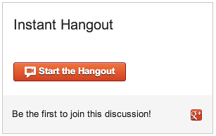

# Instant Hangouts

Instant Hangouts lets you easily add Google+ Hangouts to any web page:

    
    

which gives you:

The
[Google+ Hangout Button API](https://developers.google.com/+/hangouts/button) is
rich but requires a bit of fiddling to get details right. Instant Hangouts is a
thin wrapper that handles a bunch of the details for you:

1. By default we display a Hangout name and information about the participants,
rather than just a button to start a new Hangout.
1. The Google API is loaded asynchronously to keep your pages fast
1. Configuration is very simple: just add attributes to your `
`.

## How it works

You serve `instanthangouts.0.1.0.js`. Then, you put the following HTML into your
page where you want the Hangout to appear:

    
    

If you want more than one Hangout on your page, add additional `
`s. You
only need our script once:

    
    

    

Our script inserts a `
    

And here is an example of all supported custom fields in button mode:

    
    

## Development

This section covers development of Instant Hangouts. You don't need to read it
unless you want to contribute to the project.

We use [npm](https://npmjs.org/) for package management and
[Node.js](http://nodejs.org/) for a development server. You should install Node,
which comes with npm, in whatever way is best on your system.

Pull down the repo and install dependencies into `./node_modules` with

    $ git pull <repo>
    $ npm install

We use [Grunt](http://gruntjs.com/) to produce two files:

    instanthangouts-<version>.uncompiled.js
    instanthangouts-<version>.js

`<version>` is set in `package.json`. The first file is the source concatenated
and wrapped in a closure. The second is a minified version that users embed in
their pages. The former is useful to developers because line numbers etc. are
preserved in your debugger. When pushing a new version, be sure to update
`version` in `package.json` and update the `script` tag in `index.html` so you
generate new versions of these files. You will also want to update the `script`
tags in this document.

When developing, run

    $ grunt

which starts up a development server on `http://0.0.0.0:8080` and watch your
local files and recreate the computed files automatically every time there is a
change. This assumes you have installed `grunt-cli` globally, which is fairly
common. If you want to use the local version managed by Instant Hangouts,
instead run

    $ ./node_modules/grunt-cli/bin/grunt

We use [Karma](http://karma-runner.github.io/0.10/index.html) for our test
runner. To start:

    $ karma start

This will bring up a Chrome window and attach Karma to it. Your test code will
be run in that Chrome window. Karma has its own file watcher and reruns tests
when either the source, tests, or `index.html` changes. We use
[Jasmine](http://pivotal.github.io/jasmine/) for our test framework.
